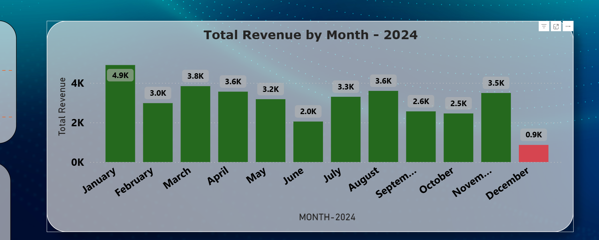
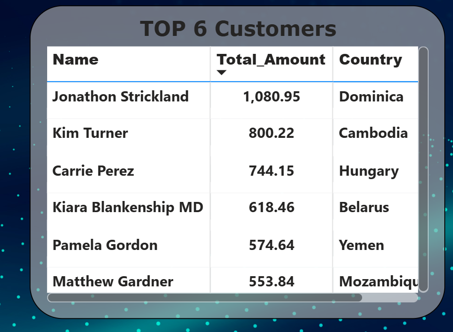

# Sales & Customer Insights Dashboard  
### SQL End-to-End Project with Power BI

This project demonstrates an end-to-end data analytics workflow using MySQL for data analysis and Power BI for dashboard visualization.

It simulates a real-world online bookstore business, answering business-driven questions using SQL and presenting insights through an interactive Power BI dashboard.

---

## Project Overview

- Designed relational database schema using MySQL  
- Solved real business questions using SQL (joins, aggregations, subqueries)  
- Imported SQL data into Power BI  
- Built interactive dashboards using DAX measures  
- Implemented conditional formatting and slicers for insights  

---

## Dataset Description

### Tables Used

**Books**
- Book_ID  
- Title  
- Genre  
- Price  
- Published_Year  

**Customers**
- Customer_ID  
- Name  
- Country  

**Orders**
- Order_ID  
- Customer_ID  
- Book_ID  
- Order_Date  
- Quantity  
- Total_Amount  

All tables are linked using primary and foreign keys.

---

## Tools & Technologies

- Database: MySQL  
- Query Language: SQL  
- Visualization: Power BI  
- Data Modeling: Power Query & Relationships  
- Measures: DAX  
- Version Control: GitHub  

---

## SQL Business Questions Solved

### Basic Queries
- Retrieve books by genre  
- Find books published after a specific year  
- Calculate total revenue from orders  
- Identify total quantity sold per genre  

### Advanced Queries
- Top customers by total spending  
- Average book price by genre  
- Customers with repeat purchases  
- Monthly revenue analysis  
- Best-selling books by quantity and revenue  

All SQL queries with answers are available in:
- `/sql/03_basic_queries.sql`  
- `/sql/04_advanced_queries.sql`  
- `/sql/05_business_questions.sql`  

---

## Power BI Dashboard

### Overall Dashboard View


---

### Monthly Revenue Trend



---

### Top Customers Analysis



---

### Genre-wise Revenue Distribution


---

## Power BI Features Used

- KPI Cards  
- Clustered Column Charts  
- Line Charts  
- Donut Chart  
- Tables with Conditional Formatting  
- Date Slicers  

Power BI file location:
- `/powerbi/Sales_and_Customer_Insights.pbix`

---

## Data Modeling

- Orders linked to Customers using Customer_ID  
- Orders linked to Books using Book_ID  
- Date field converted from Excel serial number to proper Date type  
- One-to-many relationships maintained  

---

## Sample DAX Measures

```DAX
Total Revenue =
SUM ( Orders[Total_Amount] )

MoM Revenue Growth % =
DIVIDE(
    [Revenue This Month] - [Revenue Last Month],
    [Revenue Last Month]
)
